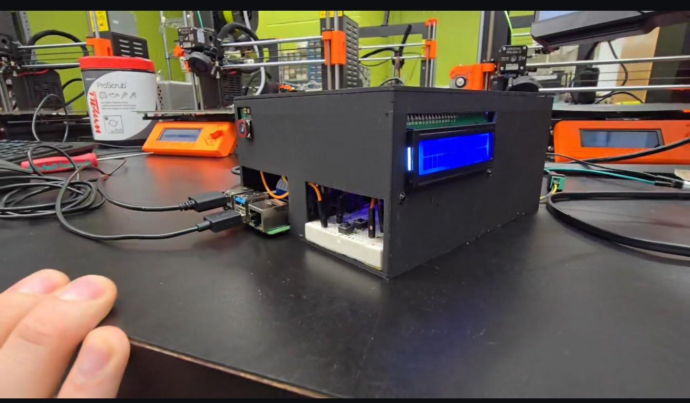
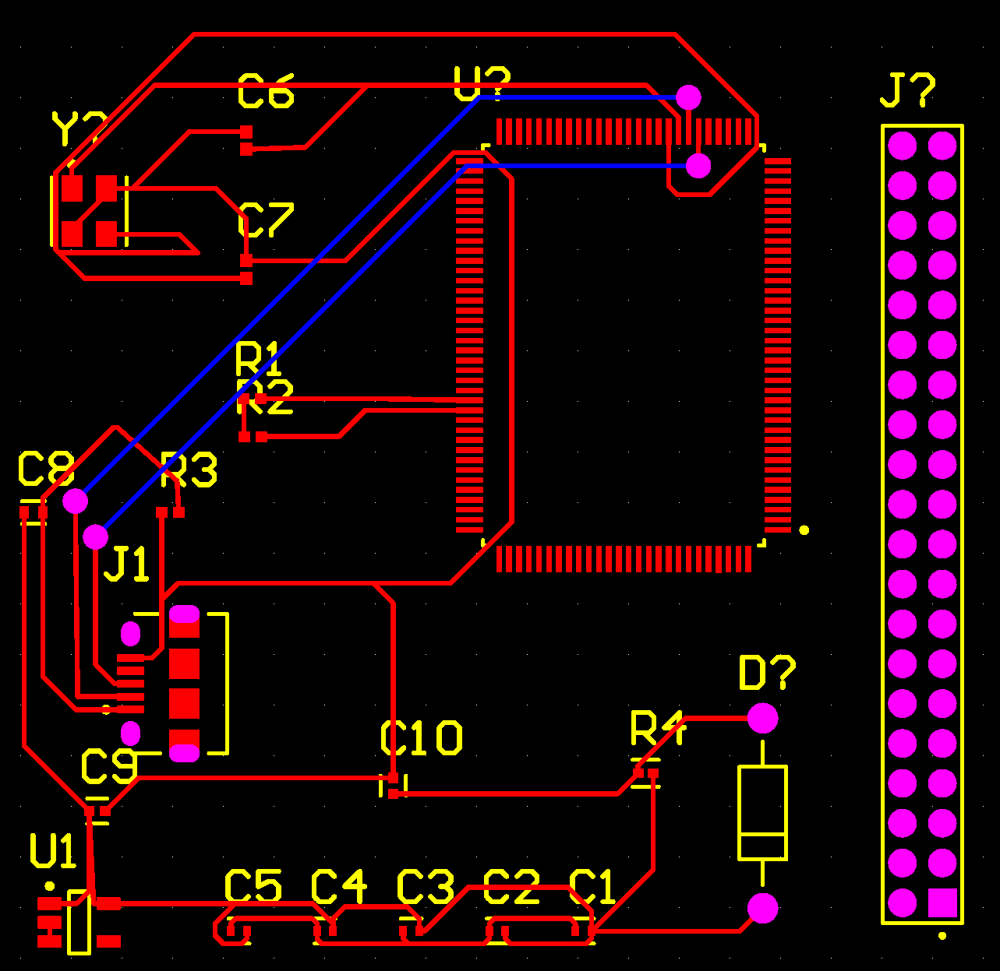
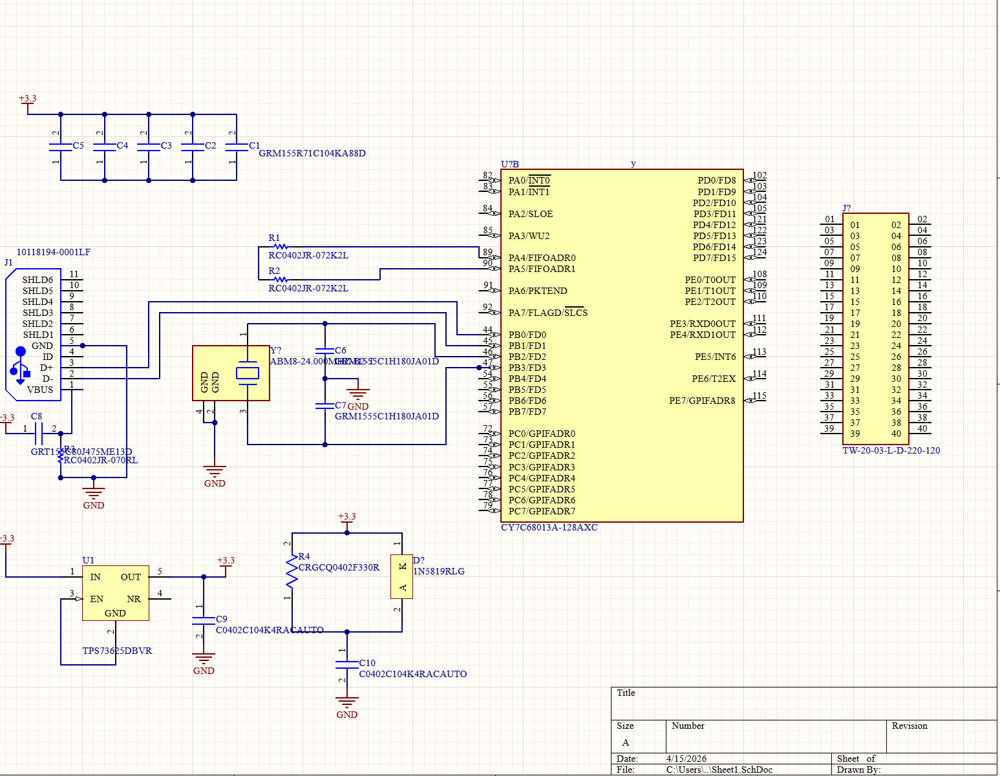

# Smart Door Facial Recognition Access System

**Pradip Sapkota**

A Raspberry Pi-based smart door access prototype that combines real-time facial recognition with physical access-control hardware. The system captures and enrolls authorized users, generates facial encodings, recognizes faces from a Pi Camera, and controls a relay-driven solenoid lock. A 16x2 LCD and status LED provide local system feedback.



## Project Highlights

- Raspberry Pi-based embedded access-control prototype
- Real-time facial recognition using `face_recognition` and OpenCV
- Pi Camera image capture and user-enrollment workflow
- Relay control for a 12 V solenoid lock
- Start/stop physical push-button controls
- 16x2 LCD status display
- Status LED indication
- 4-second unlock hold after a recognized face
- Local training pipeline that generates serialized face encodings
- Optional `systemd` service for automatic startup
- Custom PCB schematic/layout work included in the repository


## Detailed System Operation

For a full explanation of the facial-recognition pipeline, GPIO logic, relay control, 12 V lock operation, four-second unlock timer, LCD states, and hardware-control sequence, see [`SYSTEM_OPERATION.md`](SYSTEM_OPERATION.md).

## System Workflow

1. Capture several images of an authorized person with `capture_faces.py`.
2. Store images under `dataset/<person_name>/`.
3. Run `train_model.py` to generate `encodings.pickle`.
4. Start `smart_door.py`.
5. Press the START button to enable recognition.
6. The Pi Camera continuously checks visible faces.
7. A recognized user activates the status LED and relay.
8. The door remains unlocked for four seconds after the latest successful recognition.
9. Unknown faces remain locked and are shown as not recognized on the LCD.
10. Press STOP to disable recognition and force the lock output off.

## Hardware / Software Architecture

The application uses BCM GPIO numbering.

| Function | BCM GPIO |
|---|---:|
| Start button | 17 |
| Stop button | 27 |
| Status LED | 22 |
| Lock relay | 5 |
| LCD RS | 25 |
| LCD Enable | 24 |
| LCD D4 | 23 |
| LCD D5 | 18 |
| LCD D6 | 15 |
| LCD D7 | 14 |

The relay configuration in the provided software is **active-low**. Verify the behavior of your own relay module before connecting a physical lock.

## PCB Design

### Schematic



### PCB Layout



The repository includes images of the schematic and PCB layout used during the hardware design portion of the project.

## Software Structure

```text
Smart-Door-Facial-Recognition/
├── README.md
├── requirements.txt
├── .gitignore
├── assets/
│   ├── final_product.jpeg
│   ├── pcb_layout.png
│   └── pcb_schematic.png
├── demo/
│   └── README.md
├── src/
│   ├── capture_faces.py
│   ├── train_model.py
│   └── smart_door.py
└── systemd/
    └── smart-door.service
```

## Setup

### 1. Raspberry Pi

Use Raspberry Pi OS with the Pi Camera enabled and connected.

### 2. Create a virtual environment

```bash
python3 -m venv .venv
source .venv/bin/activate
```

Some Raspberry Pi camera/GPIO packages may be installed through Raspberry Pi OS rather than PyPI, depending on your OS image.

### 3. Install Python dependencies

```bash
pip install -r requirements.txt
```

The application also requires Raspberry Pi-specific packages such as `picamera2` and `RPi.GPIO`.

### 4. Enroll a person

Run:

```bash
python3 src/capture_faces.py --name "Pradip"
```

Press **SPACE** to save training images and **Q** to finish.

### 5. Generate facial encodings

```bash
python3 src/train_model.py
```

This creates `encodings.pickle`. Both the generated encoding file and the raw face dataset are excluded from Git to avoid publishing biometric data.

### 6. Run the smart door

Because `smart_door.py` expects `encodings.pickle` in the current working directory, run it from the repository root:

```bash
python3 src/smart_door.py
```

## Automatic Startup

A sample service is provided at:

```text
systemd/smart-door.service
```

Update its `User`, `WorkingDirectory`, and `ExecStart` paths for your Raspberry Pi before installing it.

Example:

```bash
sudo cp systemd/smart-door.service /etc/systemd/system/
sudo systemctl daemon-reload
sudo systemctl enable smart-door.service
sudo systemctl start smart-door.service
```

## Demo Videos

I have four project demonstration videos showing the prototype and system operation. They are not included in this package so they can be uploaded separately.

After uploading them, add links here, for example:

- Demo 1 — system overview
- Demo 2 — authorized-face recognition and unlock
- Demo 3 — unknown-face behavior
- Demo 4 — hardware / lock operation

## Privacy and Security Notes

- `dataset/` is excluded from Git because it contains face images.
- `encodings.pickle` is excluded because it contains biometric face encodings.
- Do not commit personal biometric data to a public repository.
- The project is a prototype/educational access-control system, not a certified security product.
- Verify relay fail-safe/fail-secure behavior and electrical isolation before using the design on a real door.

## Author

**Pradip Sapkota**  
Computer Engineering  
Minnesota State University, Mankato

## Project Scope

This repository documents my implementation and integration work for a facial-recognition smart-door prototype, including Raspberry Pi software, GPIO-controlled access hardware, LCD/status feedback, face enrollment/training workflow, and PCB design artifacts.
